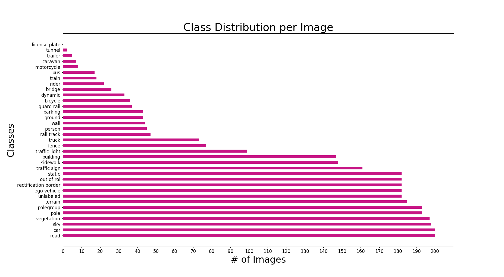

## Overview
In this repository, I worked with the [KITTI semantic segmentation dataset] (http://www.cvlibs.net/datasets/kitti/eval_semseg.php?benchmark=semantics2015) to explore both binary and multi-class segmentation of autonomous driving scenes.

## Data
The semantic segmentation dataset consists of 200 train images and 200 test images and can be downloaded [here](http://www.cvlibs.net/download.php?file=data_semantics.zip). There are 35 labeled classes, however the classes are not evenly distributed throughout the dataset. The figures below show the distribution of classes on both a per image and per pixel basis.

## Architecture
I used an encoder-decoder architecture that was based on the popular U-Net architecture[1]. The network accepts as an input a 3-channel Height x Width x 3 RGB image, downsamples the image with the encoder branch of the network and then recovers the image's original resolution using the network's decoder branch. The final output is a tensor of size Height x Width x NClasses. For binary segmentation, NClasses = 2. 

## References

[1]: Ronneberger, Olaf, Philipp Fischer, and Thomas Brox. "U-net: Convolutional networks for biomedical image segmentation." International Conference on Medical image computing and computer-assisted intervention. Springer, Cham, 2015.
