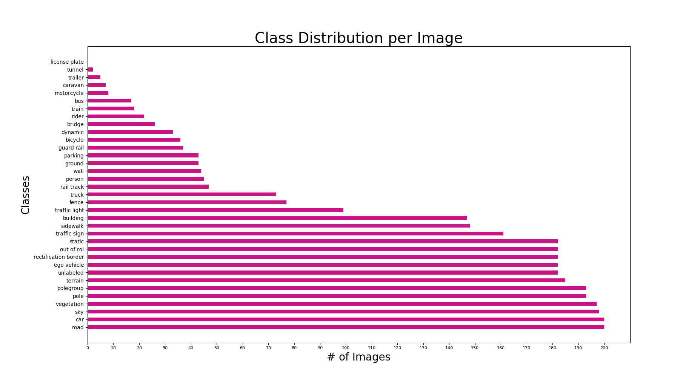
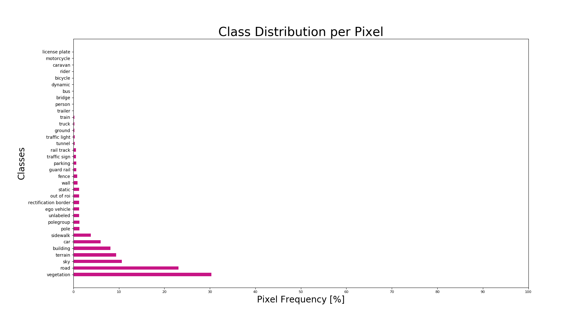

## Overview
In this repository, I worked with the [KITTI semantic segmentation dataset] (http://www.cvlibs.net/datasets/kitti/eval_semseg.php?benchmark=semantics2015) to explore both binary and multi-class segmentation of autonomous driving scenes.

## Data
The semantic segmentation dataset consists of 200 train images and 200 test images. There are 35 labeled classes, however the classes are not evenly distributed throughout the dataset. The figures below show the distribution of classes on both a per image and per pixel basis.

## Architecture

## References

[1]: Ronneberger, Olaf, Philipp Fischer, and Thomas Brox. "U-net: Convolutional networks for biomedical image segmentation." International Conference on Medical image computing and computer-assisted intervention. Springer, Cham, 2015.
